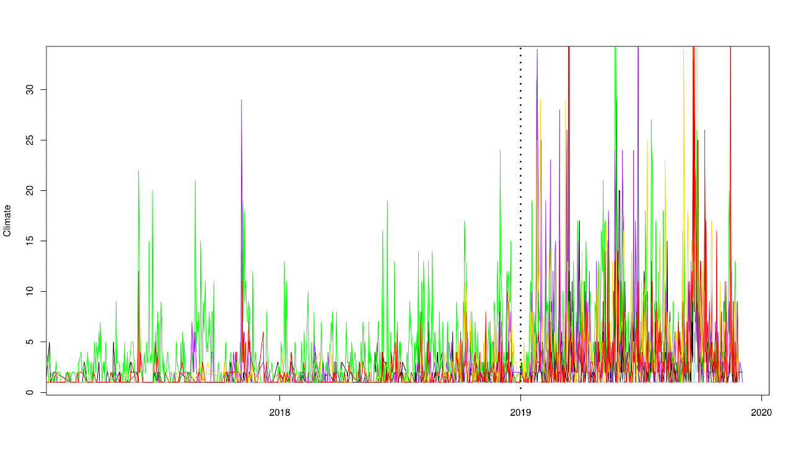

My master's thesis was my first big data project ever.

I wanted to study the communication behavior of politicians in social media.
Thus I needed the raw data from Twitter which can be accessed via the Twitter API.

In the end I had three years of tweets from almost 500 German
members of parliament (Bundestag). After sorting through and cleaning the data, I looked at roughly half a million tweets.

Since I was interested in the climate change debate, I needed to categorize the tweets via a topic model. Biterm topic models are suitable for this kind of analysis for they cluster two-word combinations which is fitting for short text analysis.

After the algorithm assigned the tweets to one of 100 categories, I manually coded the relevant topics. Those were climate, environment, anti-environment, other policy content and off-topic.

* climate: tweets directly related to climate change

* environment: tweets indirectly related to climate change, like "Erneuerbare-Energien-Gesetz"
* anti-environment: tweets opposed to environmental topics
* other policy content: tweets about other policy like "Mindestlohn"
* off-topic: tweets about non-political topics, like "Grünkohlessen"

I plotted the data for each party in the German parliament individually.
The relevant plot I want to show here is aggregated over all parties and shows all tweets about the climate topic.
Additionally, I marked the rise of Greta Thunberg and the Fridays-For-Future movement with a vertical line. The graph shows that the communication behavior changed afterwards. Further statistical research would offer more insight into the underlying mechanisms.

